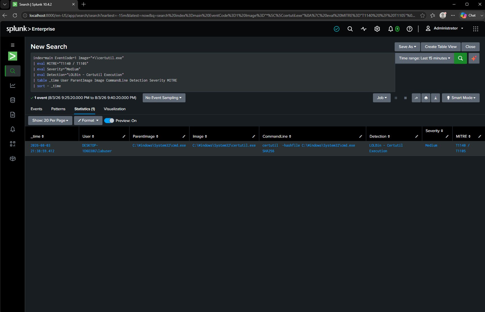

# DET-003 — LOLBin: Certutil Execution

## Objective

Detect the execution of the Windows Certutil utility, a legitimate Microsoft binary that attackers frequently abuse for downloading files, decoding payloads, and bypassing application controls.

---

## Threat Description

Certutil is a built-in Windows utility designed for certificate management. Because it is signed by Microsoft and present on nearly every Windows system, attackers commonly abuse it as a Living Off the Land Binary (LOLBin).

Malicious uses of Certutil include:

- Downloading malware from remote servers
- Decoding Base64-encoded payloads
- Encoding stolen data before exfiltration
- Hashing files during reconnaissance
- Bypassing application allowlists

Although Certutil is a legitimate administrative tool, unexpected execution should always be investigated.

---

## MITRE ATT&CK Mapping

| Technique | Description |
|-----------|-------------|
| T1140 | Deobfuscate/Decode Files or Information |
| T1105 | Ingress Tool Transfer |

---

## Attack Simulation

The following command was executed inside the Windows 10 virtual machine.

```cmd
certutil -hashfile C:\Windows\System32\cmd.exe SHA256
```

---

## SPL Detection Query

```spl
index=main EventCode=1 Image="*\\certutil.exe"
| eval MITRE="T1140 / T1105"
| eval Severity="Medium"
| eval Detection="LOLBin - Certutil Execution"
| table _time User ParentImage Image CommandLine Detection Severity MITRE
| sort -_time
```

---

## Detection Logic

The query searches Sysmon Process Creation (Event ID 1) events for executions of **certutil.exe**.

Any execution of Certutil is returned and labeled as a LOLBin activity because the binary is frequently abused by attackers despite being a legitimate Windows component.

---

## Example Detection



---

## Investigation Notes

Observed parent process:

```
cmd.exe
```

Observed user:

```
labuser
```

Observed command:

```
certutil -hashfile C:\Windows\System32\cmd.exe SHA256
```

The command successfully generated a Sysmon Process Creation event that was forwarded to Splunk through the Universal Forwarder.

---

## Possible False Positives

- System administrators
- PKI and certificate management operations
- Software integrity verification
- Security auditing scripts
- Enterprise automation tools

---

## Detection Severity

Medium

---

## Recommendations

Investigate if:

- Certutil downloads files from external URLs.
- Certutil decodes Base64-encoded content.
- Certutil executes shortly before PowerShell or Command Prompt activity.
- Newly downloaded files are executed immediately afterward.
- The process communicates with external IP addresses or creates additional executables.

Correlating Certutil activity with file creation, PowerShell execution, and outbound network connections significantly improves detection confidence.
