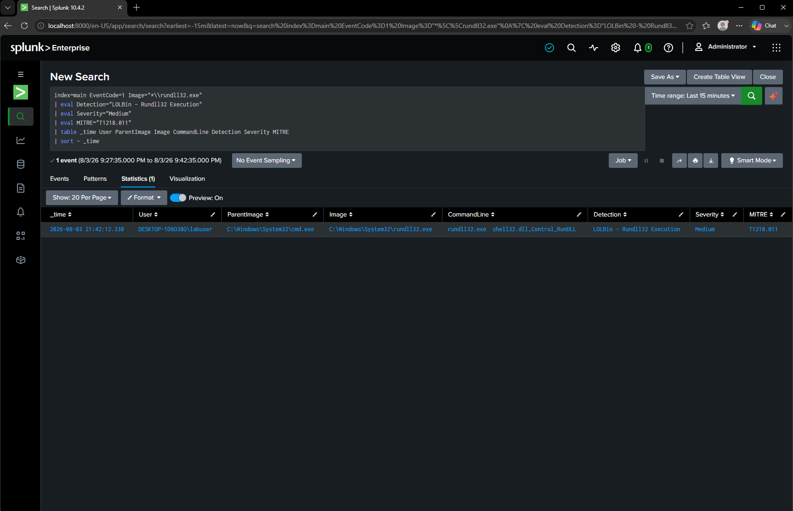

# DET-004 — LOLBin: Rundll32 Execution

## Objective

Detect the execution of **rundll32.exe**, a legitimate Windows utility that attackers commonly abuse to execute malicious DLLs, bypass application controls, and evade detection.

---

## Threat Description

Rundll32 is a built-in Windows binary used to execute exported functions from Dynamic Link Libraries (DLLs). Because it is signed by Microsoft and present on every Windows system, adversaries frequently abuse it as a Living Off the Land Binary (LOLBin).

Common malicious uses include:

- Executing malicious DLL payloads
- Launching malware while bypassing application allowlists
- Executing remote or staged code
- Establishing persistence
- Evading traditional security controls

Although Rundll32 has legitimate administrative purposes, unexpected executions should always be investigated.

---

## MITRE ATT&CK Mapping

| Technique | Description |
|-----------|-------------|
| T1218.011 | System Binary Proxy Execution: Rundll32 |

---

## Attack Simulation

The following command was executed inside the Windows 10 virtual machine.

```cmd
rundll32.exe shell32.dll,Control_RunDLL
```

---

## SPL Detection Query

```spl
index=main EventCode=1 Image="*\\rundll32.exe"
| eval Detection="LOLBin - Rundll32 Execution"
| eval Severity="Medium"
| eval MITRE="T1218.011"
| table _time User ParentImage Image CommandLine Detection Severity MITRE
| sort -_time
```

---

## Detection Logic

The query searches Sysmon Process Creation (Event ID 1) events for executions of **rundll32.exe**.

Any execution is returned because Rundll32 is a well-known LOLBin that attackers frequently abuse to proxy malicious code execution through a trusted Microsoft binary.

---

## Example Detection



---

## Investigation Notes

Observed parent process:

```
cmd.exe
```

Observed user:

```
labuser
```

Observed command:

```
rundll32.exe shell32.dll,Control_RunDLL
```

The command successfully generated a Sysmon Process Creation event that was forwarded to Splunk through the Universal Forwarder.

---

## Possible False Positives

- Windows Control Panel components
- Software installers
- Legitimate Windows administration
- Enterprise management software
- Vendor applications using DLL exports

---

## Detection Severity

Medium

---

## Recommendations

Investigate if:

- Rundll32 loads DLLs from user-writable directories.
- The command references unusual DLLs or exported functions.
- Rundll32 is spawned by Microsoft Office, browsers, scripting engines, or PowerShell.
- Additional PowerShell activity, scheduled tasks, registry modifications, or outbound network connections follow the execution.
- The executed DLL is unsigned or located outside standard Windows directories.

Correlating Rundll32 executions with process ancestry, file creation events, and network activity significantly improves detection confidence.
