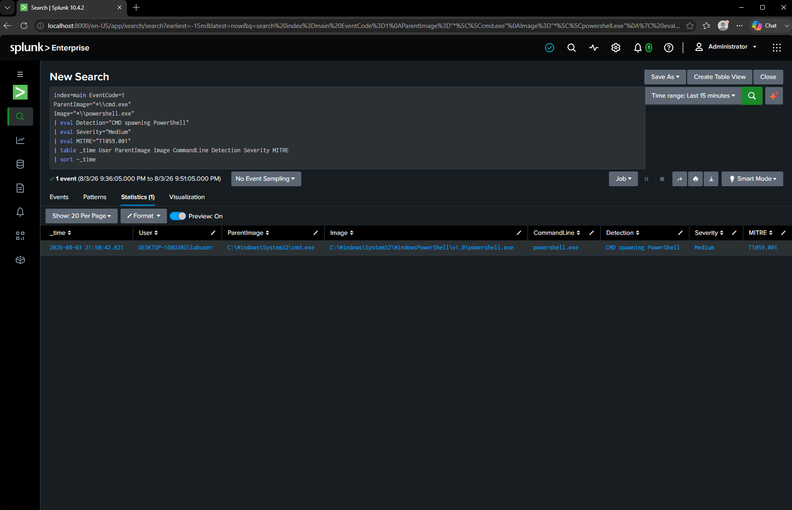

# DET-005 — CMD Spawning PowerShell

## Objective

Detect PowerShell processes launched directly from the Windows Command Prompt (cmd.exe). Parent-child process relationships provide valuable context during investigations and can reveal suspicious execution chains commonly observed during post-exploitation.

---

## Threat Description

Attackers frequently launch PowerShell from Command Prompt after obtaining access to a Windows system. This technique allows adversaries to execute scripts, download payloads, perform reconnaissance, establish persistence, or move laterally throughout the environment.

While administrators may legitimately launch PowerShell from Command Prompt, this behavior should be reviewed alongside the executed commands and surrounding process activity.

Examples include:

- Executing PowerShell payloads
- Running administrative scripts
- Downloading remote content
- Executing encoded commands
- Performing post-exploitation tasks

---

## MITRE ATT&CK Mapping

| Technique | Description |
|-----------|-------------|
| T1059.001 | PowerShell |

---

## Attack Simulation

The following command was executed inside the Windows 10 virtual machine.

```cmd
powershell.exe
```

This launched PowerShell directly from **cmd.exe**, generating the expected parent-child process relationship.

---

## SPL Detection Query

```spl
index=main EventCode=1
ParentImage="*\\cmd.exe"
Image="*\\powershell.exe"
| eval Detection="CMD spawning PowerShell"
| eval Severity="Medium"
| eval MITRE="T1059.001"
| table _time User ParentImage Image CommandLine Detection Severity MITRE
| sort -_time
```

---

## Detection Logic

The query searches Sysmon Process Creation (Event ID 1) events where the parent process is **cmd.exe** and the child process is **powershell.exe**.

Monitoring parent-child relationships provides valuable context during investigations because suspicious execution chains are often more indicative of malicious activity than individual processes alone.

---

## Example Detection



---

## Investigation Notes

Observed parent process:

```
cmd.exe
```

Observed child process:

```
powershell.exe
```

Observed user:

```
labuser
```

The PowerShell process was successfully launched from Command Prompt, generating a Sysmon Process Creation event that was forwarded to Splunk through the Universal Forwarder.

---

## Possible False Positives

- System administrators
- PowerShell automation scripts
- Software deployment tools
- Enterprise management software
- Legitimate troubleshooting activities

---

## Detection Severity

Medium

---

## Recommendations

Investigate if:

- PowerShell is launched immediately after Office documents, web browsers, or scripting engines.
- Additional suspicious PowerShell flags (such as **-nop**, **-enc**, or **-ExecutionPolicy Bypass**) are present.
- The PowerShell process downloads remote content or spawns additional child processes.
- Registry modifications, scheduled tasks, or outbound network connections follow the execution.

Correlating parent-child process relationships with PowerShell command-line arguments and network activity significantly improves detection confidence.
