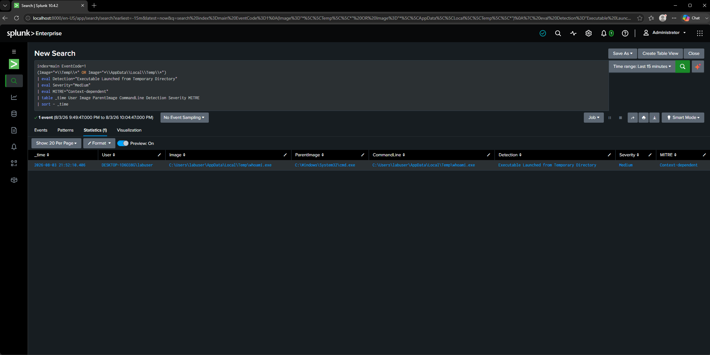

# DET-006 — Executable Launched from Temporary Directory

## Objective

Detect executables launched directly from the Windows temporary directory. Malware frequently drops payloads into temporary folders before executing them to evade detection and avoid writing to protected system locations.

---

## Threat Description

The Windows temporary directory is commonly abused by attackers because it is writable by standard users and routinely used by applications to store short-lived files.

Malicious payloads executed from temporary folders are often associated with:

- Initial malware execution
- Downloaded payloads
- Phishing attachments
- Living-off-the-land attacks
- Dropper malware
- Staged infections

Although legitimate installers may also execute files from temporary directories, this behavior should always be reviewed in context.

---

## MITRE ATT&CK Mapping

| Technique | Description |
|-----------|-------------|
| T1204.002 | User Execution: Malicious File |
| T1059 | Command and Scripting Interpreter |

---

## Attack Simulation

The following executable was copied into the Windows temporary directory and executed.

```cmd
copy C:\Windows\System32\calc.exe %TEMP%\calc.exe
%TEMP%\calc.exe
```

This generated a Sysmon Process Creation event where the executable originated from the user's temporary folder.

---

## SPL Detection Query

```spl
index=main EventCode=1
(Image="*\\Temp\\*.exe" OR Image="*\\AppData\\Local\\Temp\\*.exe")
| eval Detection="Executable launched from Temp directory"
| eval Severity="Medium"
| eval MITRE="T1204.002"
| table _time User Image ParentImage CommandLine Detection Severity MITRE
| sort -_time
```

---

## Detection Logic

The query searches Sysmon Process Creation (Event ID 1) events where the executable path contains the Windows temporary directory.

Executables launched from temporary folders are uncommon during normal user activity and frequently appear during malware execution, making this behavior valuable for threat hunting.

---

## Example Detection



---

## Investigation Notes

Observed execution path:

```
C:\Users\labuser\AppData\Local\Temp\
```

Observed parent process:

```
cmd.exe
```

Observed user:

```
labuser
```

The executable successfully launched from the temporary directory, generating a Sysmon Process Creation event that was forwarded to Splunk through the Universal Forwarder.

---

## Possible False Positives

- Software installers
- Software updaters
- Self-extracting archives
- Enterprise deployment software
- Temporary application launchers

---

## Detection Severity

Medium

---

## Recommendations

Investigate if:

- Unsigned executables launch from temporary directories.
- The executable immediately spawns PowerShell, CMD, or scripting engines.
- Network connections occur shortly after execution.
- Additional persistence mechanisms such as Registry Run Keys or Scheduled Tasks are created.
- Multiple executables launch from temporary folders within a short period.

Correlating temporary directory execution with file creation events and outbound network activity significantly improves detection confidence.
