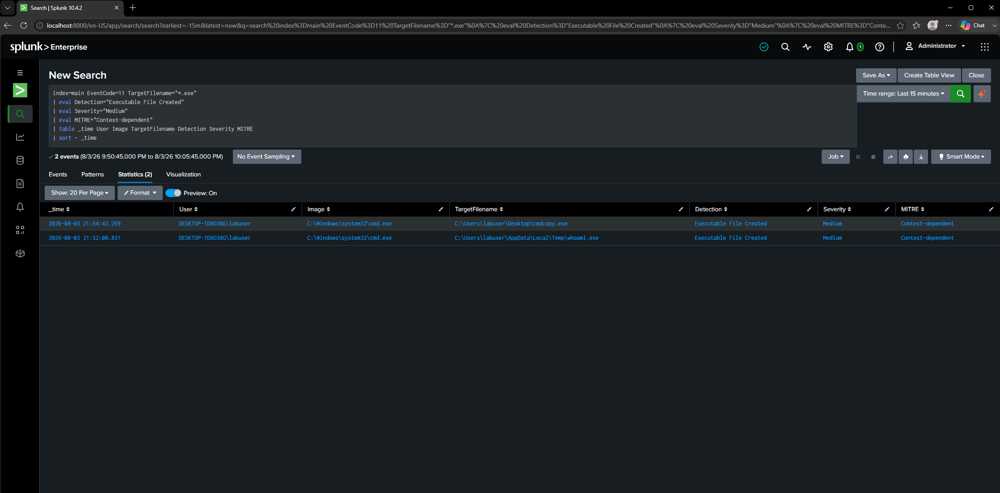

# DET-007 — Executable File Creation

## Objective

Detect the creation of executable (`.exe`) files on the monitored Windows endpoint. Monitoring newly created executables helps identify potentially suspicious payloads before they are executed.

---

## Threat Description

Many attacks involve dropping an executable onto a compromised system before running it. Malware, phishing attachments, remote access trojans (RATs), and ransomware frequently create executable files in user-writable locations before execution.

Although executable creation is not inherently malicious, unexpected `.exe` files should be investigated to determine their origin and purpose.

Examples include:

- Downloaded malware
- Dropped payloads
- Self-extracting archives
- Staged executables
- Unauthorized software

---

## MITRE ATT&CK Mapping

| Technique | Description |
|-----------|-------------|
| Context-dependent | File creation alone does not identify a specific ATT&CK technique. Additional context is required. |

---

## Attack Simulation

The following command was executed inside the Windows 10 virtual machine.

```cmd
copy C:\Windows\System32\cmd.exe C:\Users\labuser\Desktop\cmdcopy.exe
```

This generated a Sysmon File Create (Event ID 11) event.

---

## SPL Detection Query

```spl
index=main EventCode=11 TargetFilename="*.exe"
| eval Detection="Executable File Created"
| eval Severity="Medium"
| eval MITRE="Context-dependent"
| table _time User Image TargetFilename Detection Severity MITRE
| sort -_time
```

---

## Detection Logic

The query searches Sysmon File Create (Event ID 11) events for newly created executable files.

Monitoring executable creation provides an opportunity to identify suspicious payloads before they are launched, allowing analysts to investigate the source of the file and correlate it with additional telemetry.

---

## Example Detection



---

## Investigation Notes

Observed creating process:

```
cmd.exe
```

Observed user:

```
labuser
```

Observed created file:

```
cmdcopy.exe
```

The executable file creation successfully generated a Sysmon File Create event that was forwarded to Splunk through the Universal Forwarder.

---

## Possible False Positives

- Legitimate software installation
- Software updates
- Administrative tools
- Enterprise deployment platforms
- Development and build environments

---

## Detection Severity

Medium

---

## Recommendations

Investigate if:

- Executable files are created in user-writable directories such as **Desktop**, **Downloads**, **Temp**, or **AppData**.
- The newly created executable is unsigned or has an unknown publisher.
- The executable is launched shortly after being created.
- The creating process is PowerShell, Certutil, Rundll32, or another commonly abused LOLBin.
- The executable establishes outbound network connections or creates persistence mechanisms.

Correlating file creation events with subsequent process execution significantly improves detection confidence.
