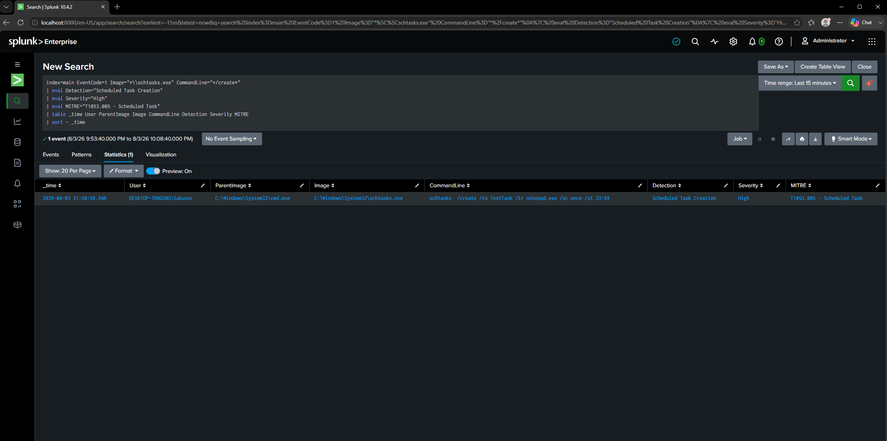

# DET-009 — Scheduled Task Creation

## Objective

Detect the creation of Windows Scheduled Tasks, a common persistence mechanism used by attackers to automatically execute programs or scripts at a specified time or when specific system events occur.

---

## Threat Description

Windows Task Scheduler allows users and administrators to automate tasks. Adversaries frequently abuse this feature to establish persistence, execute malware after reboot, or periodically run malicious commands without user interaction.

Common malicious uses include:

- Malware persistence
- Ransomware execution
- Periodic beaconing
- Privilege escalation
- Scheduled payload execution

Although Scheduled Tasks are widely used for legitimate administration, unexpected task creation should always be investigated.

---

## MITRE ATT&CK Mapping

| Technique | Description |
|-----------|-------------|
| T1053.005 | Scheduled Task |

---

## Attack Simulation

The following command was executed inside the Windows 10 virtual machine.

```cmd
schtasks /create ^
/tn TestTask ^
/tr notepad.exe ^
/sc once ^
/st 23:59
```

This created a Scheduled Task named **TestTask** that launches Notepad.

---

## SPL Detection Query

```spl
index=main EventCode=1
Image="*\\schtasks.exe"
CommandLine="*/create*"
| eval Detection="Scheduled Task Creation"
| eval Severity="High"
| eval MITRE="T1053.005"
| table _time User ParentImage Image CommandLine Detection Severity MITRE
| sort -_time
```

---

## Detection Logic

The query searches Sysmon Process Creation (Event ID 1) events for executions of **schtasks.exe** where the `/create` argument is present.

By focusing specifically on task creation, the detection avoids matching task deletion or query operations and provides more actionable results.

---

## Example Detection



---

## Investigation Notes

Observed parent process:

```
cmd.exe
```

Observed user:

```
labuser
```

Observed command:

```
schtasks /create /tn TestTask /tr notepad.exe /sc once /st 23:59
```

The Scheduled Task creation successfully generated a Sysmon Process Creation event that was forwarded to Splunk through the Universal Forwarder.

---

## Possible False Positives

- System administrators
- Enterprise software deployment
- Windows maintenance tasks
- IT automation scripts
- Backup software

---

## Detection Severity

High

---

## Recommendations

Investigate if:

- Scheduled Tasks execute PowerShell, Command Prompt, Rundll32, or other scripting engines.
- The task launches executables from **Temp**, **Downloads**, or **AppData**.
- The task was created by an unexpected user account.
- Registry Run Key modifications or additional persistence mechanisms appear shortly afterward.
- The scheduled executable establishes outbound network connections or spawns suspicious child processes.

Correlating Scheduled Task creation with process execution, registry activity, and network telemetry significantly improves detection confidence.
