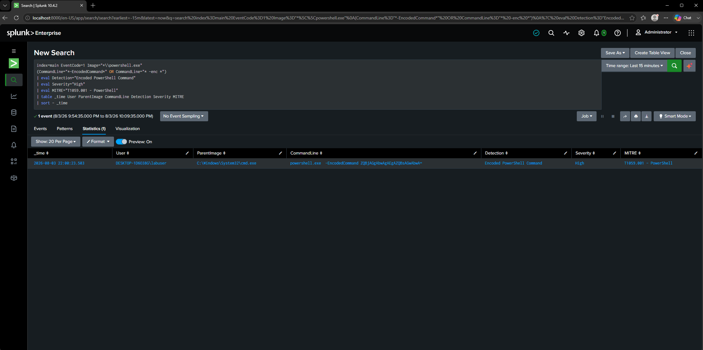

# DET-010 — Encoded PowerShell Command

## Objective

Detect PowerShell executions that use Base64-encoded commands. Encoding is commonly used by attackers to obfuscate malicious PowerShell payloads and reduce their visibility during execution.

---

## Threat Description

PowerShell supports the **-EncodedCommand** parameter, allowing commands to be supplied as Base64-encoded strings.

Adversaries frequently abuse encoded commands to:

- Obfuscate malicious scripts
- Bypass simple command-line monitoring
- Execute payloads directly in memory
- Download additional malware
- Evade basic detection rules

Although administrators may occasionally use encoded commands for automation, unexpected use of **-EncodedCommand** should always be investigated.

---

## MITRE ATT&CK Mapping

| Technique | Description |
|-----------|-------------|
| T1059.001 | PowerShell |

---

## Attack Simulation

The following command was executed inside the Windows 10 virtual machine.

```powershell
powershell.exe -EncodedCommand ZQBjAGgAbwAgAEgAZQBsAGwAbwA=
```

This launched PowerShell using a Base64-encoded command, generating a Sysmon Process Creation event.

---

## SPL Detection Query

```spl
index=main EventCode=1
Image="*\\powershell.exe"
(CommandLine="*-EncodedCommand*" OR CommandLine="* -enc *")
| eval Detection="Encoded PowerShell Command"
| eval Severity="High"
| eval MITRE="T1059.001"
| table _time User ParentImage CommandLine Detection Severity MITRE
| sort -_time
```

---

## Detection Logic

The query searches Sysmon Process Creation (Event ID 1) events for PowerShell executions containing the **-EncodedCommand** or **-enc** parameters.

Because encoded PowerShell commands are frequently associated with malicious activity, each matching event should be reviewed to determine the decoded command and surrounding process activity.

---

## Example Detection



---

## Investigation Notes

Observed parent process:

```
cmd.exe
```

Observed user:

```
labuser
```

Observed command:

```
powershell.exe -EncodedCommand ZQBjAGgAbwAgAEgAZQBsAGwAbwA=
```

The encoded PowerShell execution successfully generated a Sysmon Process Creation event that was forwarded to Splunk through the Universal Forwarder.

---

## Possible False Positives

- PowerShell automation scripts
- Enterprise administration tools
- Configuration management platforms
- Software deployment solutions
- Security testing activities

---

## Detection Severity

High

---

## Recommendations

Investigate if:

- Encoded PowerShell is executed by Microsoft Office, web browsers, or scripting engines.
- The encoded command downloads remote content or establishes outbound network connections.
- Registry Run Keys or Scheduled Tasks are created shortly after execution.
- Additional PowerShell processes or child processes are spawned.
- The decoded command contains suspicious keywords such as **Invoke-WebRequest**, **DownloadString**, **IEX**, or **Net.WebClient**.

Correlating encoded PowerShell executions with network activity, registry modifications, scheduled tasks, and child process creation significantly improves detection confidence.
