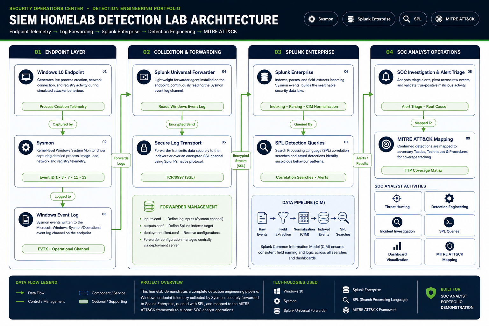
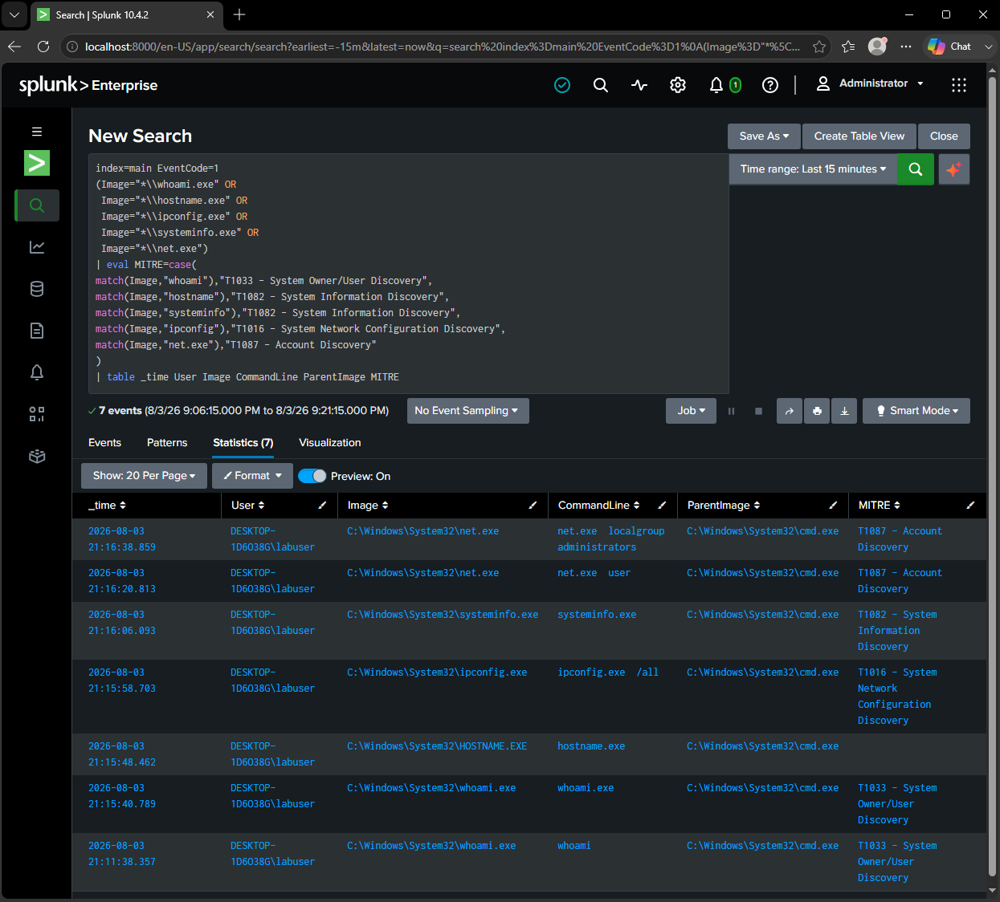
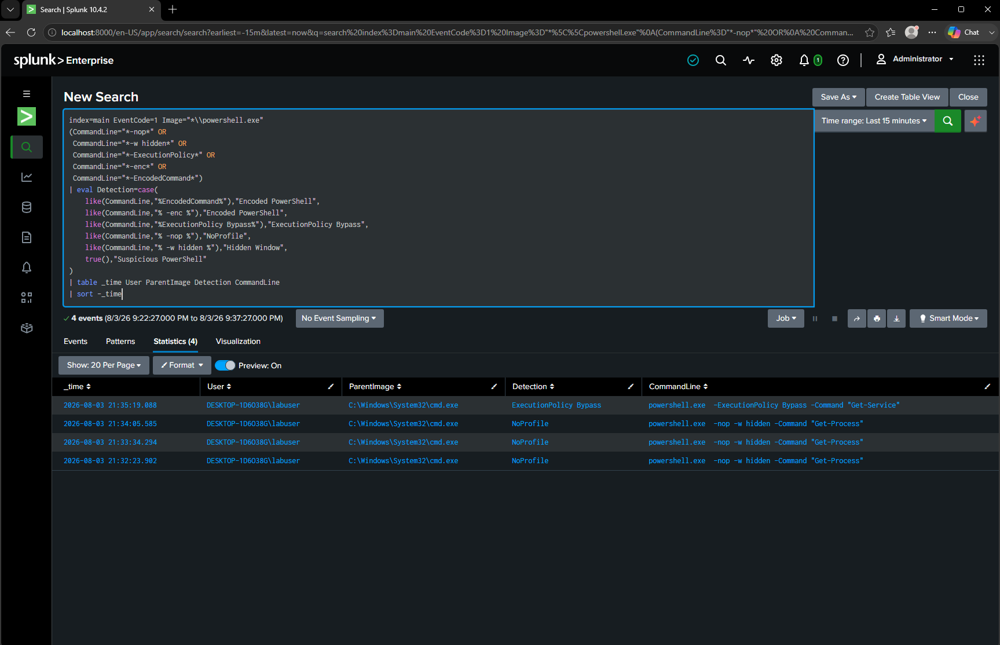
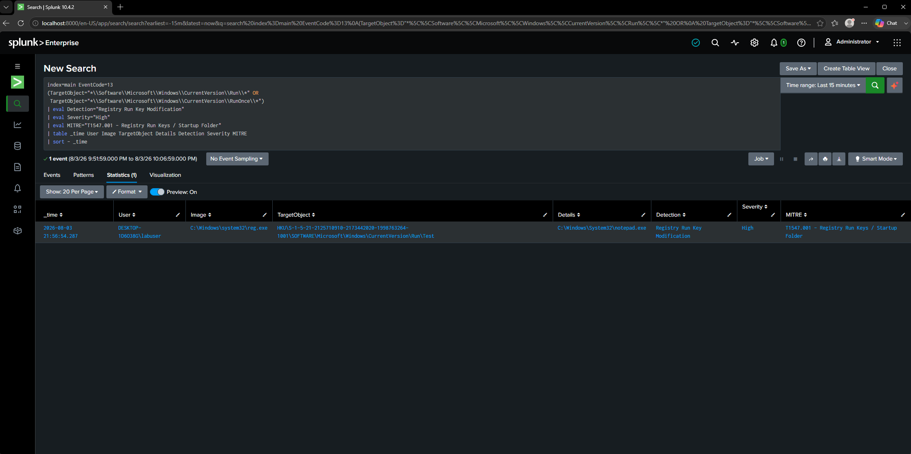
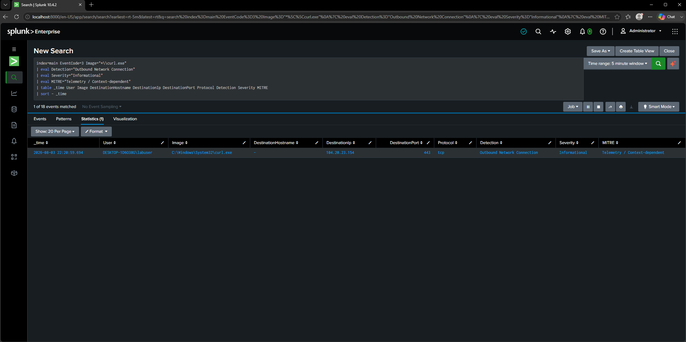

# SIEM Homelab Detection Lab

A Windows-based SIEM and detection engineering project built with Sysmon, Splunk Enterprise, and the Splunk Universal Forwarder.

The lab demonstrates the full detection workflow:

**Endpoint activity → Sysmon telemetry → Windows Event Logs → Splunk ingestion → SPL detection → Investigation → MITRE ATT&CK mapping**

> All activity was generated inside an isolated and authorized virtual lab for defensive-security education.

---

## Project Highlights

- **1** monitored Windows 10 endpoint
- **11** tested SPL detections
- Sysmon process, network, file, and registry telemetry
- Splunk Universal Forwarder ingestion over TCP port `9997`
- MITRE ATT&CK mapping
- Controlled attack and behavior simulations
- Investigation evidence captured directly from Splunk

---

## Project Overview

This project simulates the workflow of a Security Operations Center analyst monitoring and investigating suspicious activity on a Windows endpoint.

Sysmon generates detailed endpoint telemetry inside a Windows 10 virtual machine. The Splunk Universal Forwarder collects the Sysmon events and sends them to Splunk Enterprise, where the data is parsed, searched, investigated, and converted into custom SPL detections.

The project covers:

- Windows endpoint telemetry collection
- Sysmon configuration and event analysis
- Splunk log ingestion and field extraction
- Process and command-line investigation
- Parent-child process analysis
- Network connection monitoring
- File-creation monitoring
- Registry persistence detection
- Controlled behavior simulations
- Custom SPL detection development
- MITRE ATT&CK mapping
- Investigation screenshots
- Detection tuning and false-positive considerations

---

## Lab Architecture



---

## Technologies Used

| Technology | Purpose |
|---|---|
| Oracle VirtualBox | Hosted the isolated virtual lab |
| Windows 10 | Monitored endpoint |
| Sysmon | Generated detailed Windows endpoint telemetry |
| SwiftOnSecurity Sysmon Configuration | Configured Sysmon event collection |
| Splunk Universal Forwarder | Collected and forwarded Sysmon events |
| Splunk Enterprise | Indexed, searched, and investigated telemetry |
| Splunk Add-on for Sysmon | Parsed and extracted Sysmon fields |
| SPL | Built threat-hunting and detection queries |
| MITRE ATT&CK | Mapped observed behavior to adversary techniques |

---

## Data Pipeline

1. Activity occurs on the Windows 10 endpoint.
2. Sysmon records the activity in the Windows Event Log.
3. The Splunk Universal Forwarder monitors the Sysmon Operational channel.
4. Events are forwarded to Splunk Enterprise over TCP port `9997`.
5. Splunk indexes and parses the telemetry.
6. SPL searches identify activity requiring investigation.
7. Results are reviewed using process, command-line, user, registry, file, and network context.
8. Relevant behavior is mapped to MITRE ATT&CK.

---

## Lab Configuration

| Setting | Value |
|---|---|
| Sysmon Event Channel | `Microsoft-Windows-Sysmon/Operational` |
| Splunk Source | `XmlWinEventLog:Microsoft-Windows-Sysmon/Operational` |
| Splunk Sourcetype | `XmlWinEventLog:Microsoft-Windows-Sysmon/Operational` |
| Splunk Index | `main` |
| Forwarding Destination | `127.0.0.1:9997` |
| Monitored Host | Windows 10 virtual machine |

---

## Detection Catalog

| ID | Detection | Telemetry | Severity | MITRE ATT&CK |
|---|---|---|---|---|
| DET-001 | System Discovery Commands | Sysmon Event ID 1 | **Medium** | T1033, T1082, T1016, T1087 |
| DET-002 | Suspicious PowerShell Flags | Sysmon Event ID 1 | **High** | T1059.001 |
| DET-003 | Certutil Execution | Sysmon Event ID 1 | **Medium** | Context-dependent |
| DET-004 | Rundll32 Execution | Sysmon Event ID 1 | **Medium** | T1218.011 |
| DET-005 | CMD Spawning PowerShell | Sysmon Event ID 1 | **Medium** | T1059.001 |
| DET-006 | Execution from Temporary Directory | Sysmon Event ID 1 | **Medium** | Context-dependent |
| DET-007 | Executable File Creation | Sysmon Event ID 11 | **Medium** | Context-dependent |
| DET-008 | Registry Run Key Modification | Sysmon Event ID 13 | **High** | T1547.001 |
| DET-009 | Scheduled Task Creation | Sysmon Event ID 1 | **High** | T1053.005 |
| DET-010 | Encoded PowerShell Command | Sysmon Event ID 1 | **High** | T1059.001 |
| DET-011 | Outbound Network Connection | Sysmon Event ID 3 | **Informational** | Context-dependent |

> Context-dependent detections identify suspicious telemetry that requires additional evidence before assigning a specific ATT&CK technique.

---

## Featured Detection Results

### System Discovery Commands

<p align="center">

</p>

### Suspicious PowerShell Flags

<p align="center">

</p>

### Registry Run Key Persistence

<p align="center">

</p>
### Process-Linked Network Connection

<p align="center">

</p>
The complete evidence set is available in the [`Screenshots`](Screenshots/) directory.

---

## Example SPL Detection

### Suspicious PowerShell Flags

```spl
index=main EventCode=1 Image="*\\powershell.exe"
(CommandLine="*-nop*" OR
 CommandLine="*-w hidden*" OR
 CommandLine="*-ExecutionPolicy*" OR
 CommandLine="*-enc*" OR
 CommandLine="*-EncodedCommand*")
| eval Detection=case(
    like(CommandLine,"%EncodedCommand%"),"Encoded PowerShell",
    like(CommandLine,"% -enc %"),"Encoded PowerShell",
    like(CommandLine,"%ExecutionPolicy Bypass%"),"ExecutionPolicy Bypass",
    like(CommandLine,"% -nop %"),"NoProfile",
    like(CommandLine,"% -w hidden %"),"Hidden Window",
    true(),"Suspicious PowerShell"
)
| table _time User ParentImage Detection CommandLine
| sort - _time
```

This query identifies PowerShell processes launched with command-line arguments frequently associated with suspicious execution. These arguments are not automatically malicious, so the result must be reviewed alongside the parent process, user, command line, and surrounding activity.

---

## Investigation Workflow

Each detection followed the same workflow:

1. Define the behavior to investigate.
2. Generate controlled activity inside the isolated VM.
3. Confirm that Sysmon recorded the relevant event.
4. Locate and inspect the telemetry in Splunk.
5. Review the user, parent process, process image, command line, and related fields.
6. Write and test an SPL detection.
7. Add analyst-friendly fields such as detection name and severity.
8. Validate the MITRE ATT&CK mapping.
9. Consider legitimate use cases and possible false positives.
10. Capture screenshot evidence.

---

## Skills Demonstrated

- SIEM deployment and configuration
- Windows endpoint monitoring
- Sysmon configuration and analysis
- Splunk Universal Forwarder configuration
- Splunk field extraction
- SPL development
- Detection engineering
- Threat hunting
- Process and command-line analysis
- Parent-child process investigation
- Registry monitoring
- File-creation monitoring
- Network connection analysis
- MITRE ATT&CK mapping
- Detection tuning
- False-positive analysis
- Security documentation

---

## Repository Structure

```text
SIEM-Homelab-Detection-Lab/
├── Architecture/
├── Attack-Simulations/
├── Detection-Queries/
├── MITRE-Mapping/
├── Screenshots/
├── Setup/
├── LICENSE
├── Lessons-Learned.md
└── README.md
```

---

## Key Lessons Learned

- Log generation, ingestion, parsing, and field extraction must be validated separately.
- A connected Universal Forwarder does not automatically guarantee useful searchable telemetry.
- Raw XML searches can confirm ingestion before field extraction is working.
- Parent-child process relationships provide important investigative context.
- Tool execution alone does not always prove malicious intent.
- ATT&CK mappings should reflect observed behavior rather than executable names alone.
- Broad detections require tuning and environmental baselining.
- Troubleshooting the telemetry pipeline is an important SIEM engineering skill.

A detailed reflection is available in [`Lessons-Learned.md`](Lessons-Learned.md).

---

## Future Improvements

- Separate Splunk Enterprise and the monitored endpoint into different virtual machines
- Collect Windows Security Event Logs
- Enable PowerShell Script Block Logging Event ID 4104
- Add Active Directory attack detection
- Convert suitable detections into Sigma rules
- Create Splunk dashboards and scheduled alerts
- Build correlation searches across multiple event types
- Use Atomic Red Team for repeatable simulations
- Add Zeek or Suricata network telemetry
- Test the detections against another SIEM platform

---

## Disclaimer

This project was conducted in an isolated and authorized virtual lab for defensive-security education. No production systems, real organizational data, or unauthorized targets were used.

---

## Credits

- Microsoft Sysinternals Sysmon
- Splunk Enterprise
- Splunk Universal Forwarder
- Splunk Add-on for Sysmon
- SwiftOnSecurity Sysmon configuration
- MITRE ATT&CK

Third-party tools and configurations remain the property of their respective authors.

---

## License

The original documentation and detection content in this repository are available under the [MIT License](LICENSE).
